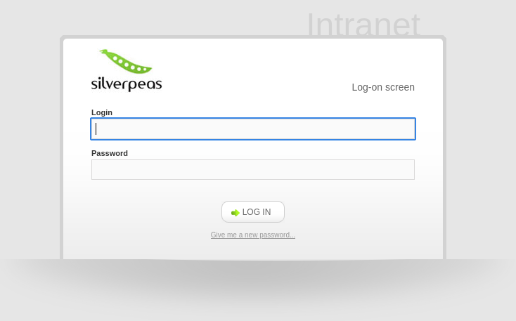
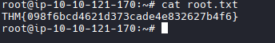

  
# TryHackMe - Silver Platter

 
## GUÍA COMPLETA EN ESPAÑOL 

  
  
  

# Indice  

## · Reconocimiento  

## · Bypass  

## · Obtención de credenciales

## · Entrada como usuario

## · Escalada de privilegios

## Reconocimiento  

Como siempre digo, como buen hacker que somos, vamos a lanzar un nmap para el escaneo de puertos:

Podemos observar tres puertos abiertos, de los cuales el que mas me llama la atención es el nginx ya que es el alojado en el puerto 80 y la versión es algo antigua, asi que vamos a empezar por ahí.

Observando la página, encontramos lo siguiente en el directorio de contacto:

Tenemos un mensaje que nos dice lo siguiente: 

"Si deseas ponerte en contacto con nosotros, comunícate con nuestro jefe de proyecto en Silverpeas. Su nombre de usuario es "scr1ptkiddy"."

Este mensaje nos revela un nombre de usuario y una aplicación; investigando sobre esta aplicación he conseguido saber que se utiliza principalmente en entornos corporativos o institucionales para mejorar la comunicación interna, la organización del trabajo y la gestión del conocimiento.
Por ejemplo, empresas, universidades, administraciones públicas o asociaciones pueden usarlo como una intranet colaborativa.

Ahora vamos a investigar el servicio del puerto 8080 del cual no obtenemos respuesta, pero, si buscamos un directorio en ese puerto llamado como la aplicación que mencionamos antes, encontramos el siguiente login:

**¿Cómo he encontrado este login?**

Debido a que en mi pequeña investigación sobre la app de silverpeas, descubrí que la aplicación tiene interfaz web con lo que probé a buscar el directorio en el nginx pero no hubo respuesta, al contrario que en el puerto 8080.  

## Bypass

Ahora buscaremos en internet algún CVE de esta app, y encontraremos la siguiente página:  

Aqui nos comenta de un posible bypass eliminando la password en la petición post de login, pero nos hace falta un username, buscando un poco más encontré el siguiente repo:  

  

Ahora abriremos la burpsuite e interceptaremos la petición de login:  

  

Modificamos la petición eliminando la password:

  

Y enviamos la petición:  

  

## Obtención de credenciales

Investigando la página, encontré una sección de notificaciones donde encontré unas credenciales para conectarse por ssh:  

  

## Entrada como usuario  

Nos conectaremos por ssh usando esas credenciales:  

  

  

## Escalada de privilegios  

Al hacer cat a /etc/passwd vemos que hay un usuario llamado tyler que posee privilegios de root:  

También se puede observar que nuestro usuario tim pertenece al grupo adm, esto nos permite leer los logs del sistema:  

  

**Explicación de comando utilizado**

**cat /var/log/auth***: Muestra el contenido de todos los archivos cuyo nombre empiece por auth en la carpeta /var/log/.

**grep -i pass:** Busca todas las líneas que contengan la palabra “pass”, sin importar mayúsculas o minúsculas (-i = case-insensitive), es decir, busca coincidencias como password, Passwd, failed password, etc.

Ahora cambiamos al usuario tyler usando la contraseña encontrada:  

  

Accedemos a root y hacemos cat a root.txt:  

  

# DISCLAIMER

Este writeup es SOLO para propósitos educativos.  
Úsalo responsablemente en entornos autorizados como TryHackMe.  

**Autor:** pablocaraballofernandez  
**Plataforma:** TryHackMe

  
  
  
  
  .
  

